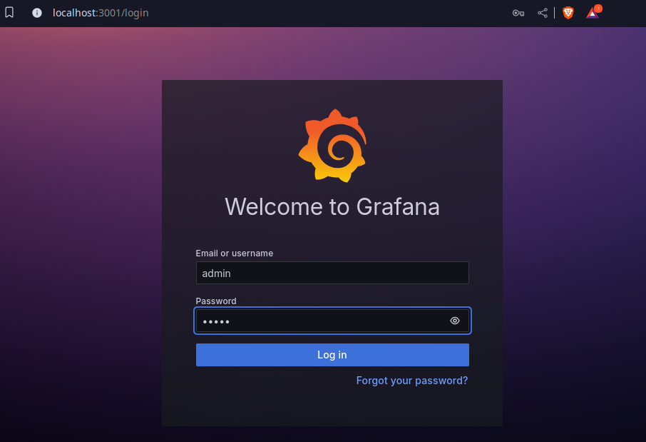
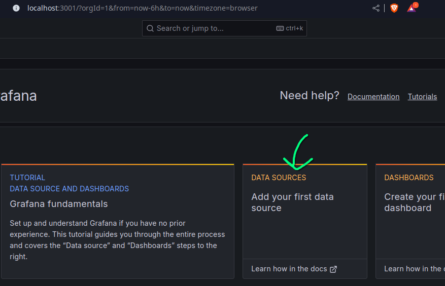
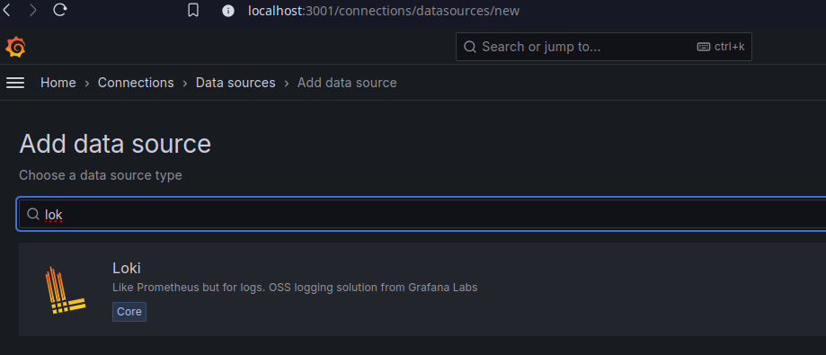
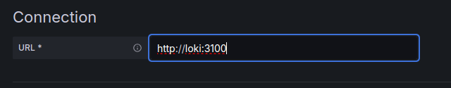
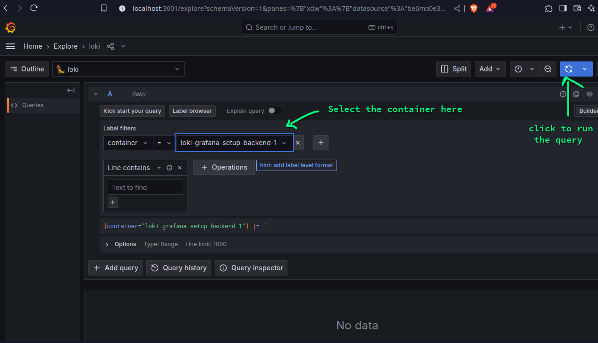
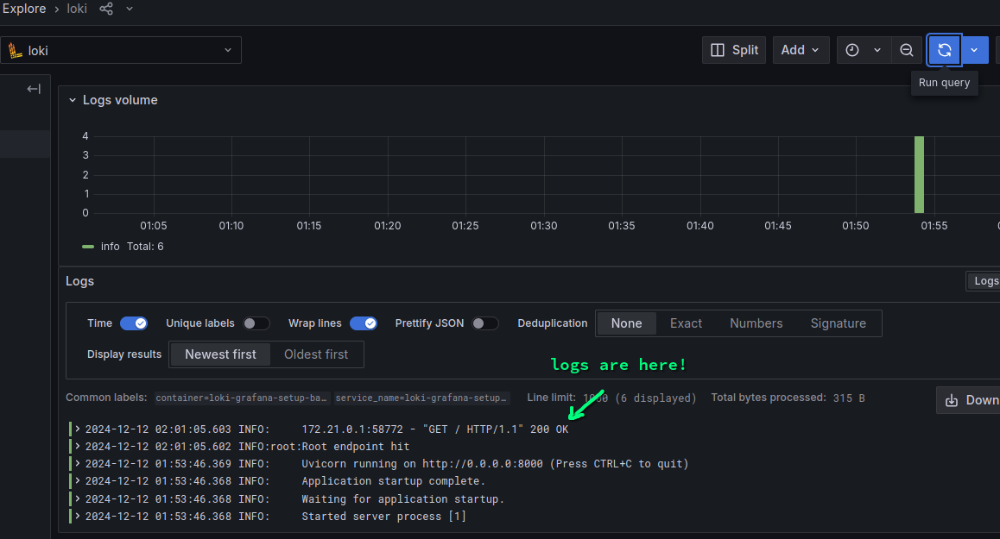

# Loki Grafana Logs

A basic 101 project to have logs in Grafana from Loki using Promtail. 

Users can split the output based on container name.

## How to configure?
1. Start the docker in your machine, for Linux use
```bash
sudo systemctl start docker
```

2. Run the docker compose
```bash
docker-compose up --build -d
```
3. Go to [`http://localhost:3001/login`](http://localhost:3001/login) to open the Grafana GUI.
    - Login with using the default user name `admin` and password `admin`. Set the new password on the prompted page. 
    - Go to `Data Source` and search for Loki. Select that.
    - In the connection url, enter `http://loki:3100` and go to end of the page to `Save & Test`. 

4. Now once the Loki is connected, go to the [`Explore`](http://localhost:3001/explore) page and make a basic query to see logs, select `container` in label and select the backend container in the value.  
5. Now go in a terminal do 
```bash
curl http://localhost:8000
```
6. Once done, you can click on fetch query (top right Blue icon), the logs would be there :rocket:! 

## Closing the containers!
Don't forget to close this after use.
```bash
docker-compose down
```

## Project setup
```bash
.
├── apps
│   ├── backend
│   │   ├── Dockerfile
│   │   ├── main.py
│   │   └── requirements.txt
│   └── frontend
│       ├── Dockerfile
│       ├── package.json
│       ├── package-lock.json
│       └── pages
│           └── index.js
├── docker-compose.yml
├── loki
│   ├── loki-config.yml
│   └── promtail-config.yml
└── README.md
```
